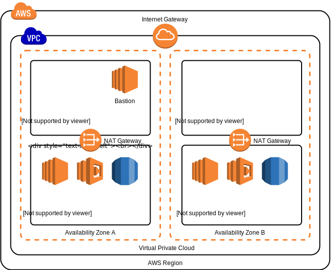

VPC Module
=====================================

Module for configuring a VPC per AWS best practice.

The sub-module `vpc_az` is used to configure multiple availability zones in the VPC.

Using this Module
-------------------------------------

A simple example is as follows. See the [variables.tf](./vpc/variables.tf) for more details on the
parameters shown:

    module "vpc" {
      source = "vpc"

      region              = "${var.region}"
      network_name        = "${var.network_name}"
      bastion_private_key = "${var.bastion_private_key}"
      bastion_public_key  = "${var.bastion_public_key}"
    }

Standard VPC Diagram
-------------------------------------

This module creates a set of resources which follow AWS best-practice for setting up a VPC.

<a href="https://www.draw.io/?mode=github#Hmafrosis%2Finfrastructure%2Fmaster%2Fvpc%2FArch.svg" target="_blank">Edit</a>

Security Groups
-------------------------------------

The VPC configuration defines IP address whitelisting for SSH connections into the VPC via the
[bastion](./vpc/bastion.tf#L73). This can be modified to prevent or allow IPs to SSH into the VPC
infrastructure.

DNS Inside The VPC
-------------------------------------

It's often very useful to configure DNS records for hosts inside the VPC. Intra-VPC DNS allows
services to then be configured with hostnames, as opposed to private IP addresses (which are prone
to change).

### When the VPC is created

The following example Terraform configuration would setup a VPC-internal hostname for the Jenkins
server:

    resource "aws_route53_record" "jenkins" {
      zone_id = "${module.vpc.vpc_route53_zone_id}"
      name    = "jenkins.${var.network_name}.internal"
      type    = "A"
      ttl     = "30"

      records = [
        "${aws_instance.jenkins.private_ip}",
      ]
    }

As you can see the variable `${module.vpc.vpc_route53_zone_id}` is using the Route53 `zone_id`
output by this module.

### When deploying into an existing VPC

And the following configuration comes from `mafrosis-web-ui`, which deploys into an already existing
VPC called `ci.internal`:

    # Locate the "ci.internal" Route53 zone
    data "aws_route53_zone" "vpc" {
      name   = "ci.internal"
      vpc_id = "${var.vpc_id}"
    }

    # Create an intra-VPC hostname for this EC2 server
    resource "aws_route53_record" "mafrosis-web-ui" {
      zone_id = "${data.aws_route53_zone.vpc.zone_id}"
      name    = "mafrosis-web-ui.${data.aws_route53_zone.vpc.name}"
      type    = "A"
      ttl     = "30"

      records = [
        "${aws_instance.mafrosis-web-ui.private_ip}",
      ]
    }

Bastion Instance Profile
-------------------------------------

An instance profile is created and attached to the bastion by default. To enable extra permissions
on the bastion you should attach an IAM policy to the instance profile's role, as shown in the
following example:

    resource "aws_iam_role_policy" "bastion_policy" {
      name = "bastion_policy"
      role = "${module.vpc.bastion_instance_role_id}"

      policy = <<EOF
    {
      "Version": "2012-10-17",
      "Statement": [
        {
          "Effect": "Allow",
          "Action": [
            "s3:List*"
          ],
          "Resource": [
            "arn:aws:s3:::mafrosis-digital-terraform-state"
          ]
        }
      ]
    }
    EOF
    }

Here a new policy is created, and is attached to the role identified by `bastion_instance_role_id`.
